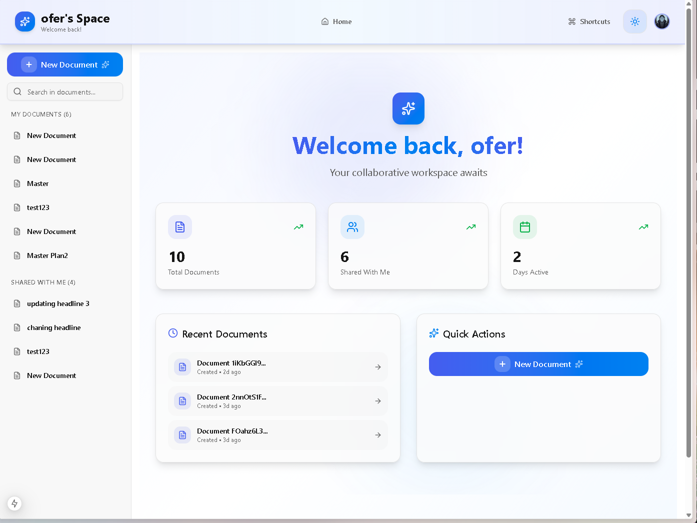
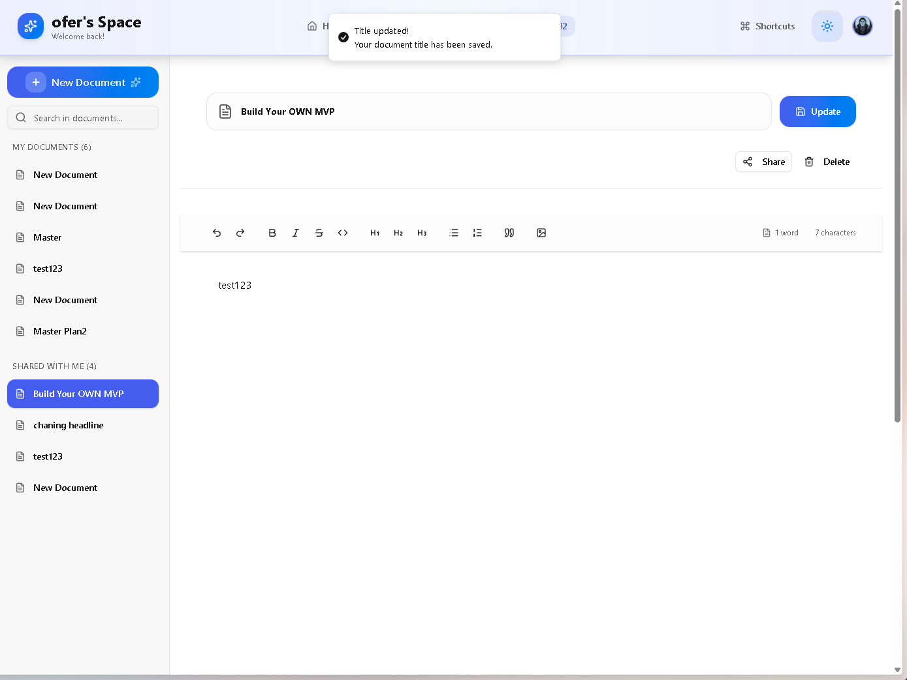
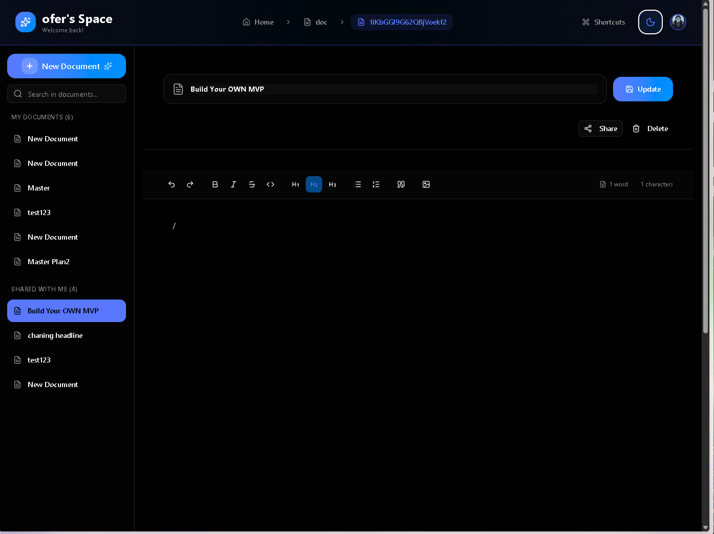
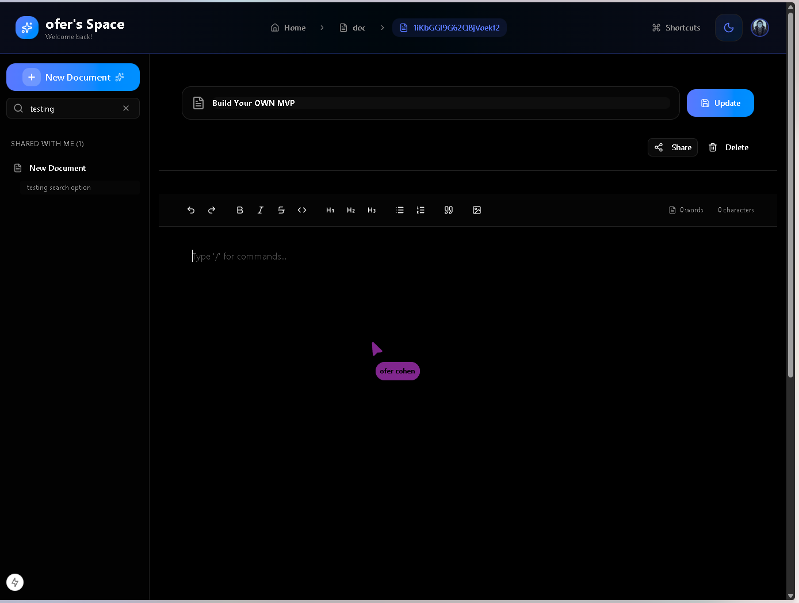

# 📝 Notion Clone

> A real-time collaborative document management and editing application

[](https://nextjs.org/)
[](https://react.dev/)
[](https://www.typescriptlang.org/)
[](https://tailwindcss.com/)
[](LICENSE)

<div align="center">
  
</div>

---

## ✨ Key Features

🚀 **Real-time Collaborative Editing** - Edit documents simultaneously with team members  
✍️ **Rich Text Editor** - Advanced formatting powered by Tiptap  
🖼️ **Image Upload** - Drag & drop, paste, or upload images with Firebase Storage  
🔍 **Full-Text Search** - Search in document titles and content  
⌨️ **Slash Commands** - Quick formatting with `/` menu  
🔐 **Secure Authentication** - Clerk authentication with Google OAuth  
🎨 **Modern Design** - Modern Notion Pro Design System  
🌙 **Dark Mode** - Full dark mode support  
📱 **Responsive** - Works seamlessly across all devices  

---

## 🎯 Demo

**🔗 [Live Demo](https://your-demo-url.vercel.app)**

### Demo Accounts:
```
Email: demo@example.com
Password: Demo123!
```

---

## 📸 Screenshots

<details>
<summary>Click to view screenshots</summary>

<br/>

### Homepage - Main Dashboard

*Clean and modern interface with document list and search functionality*

---

### Editor - Light Mode

*Rich text editor with formatting toolbar and real-time collaboration*

---

### Dark Mode


### Editor


### Real-time Collaboration



</details>

---

## 🛠️ Tech Stack

### Frontend
- **[Next.js 15](https://nextjs.org/)** - React Framework with App Router
- **[React 19](https://react.dev/)** - UI Library
- **[TypeScript](https://www.typescriptlang.org/)** - Type Safety
- **[Tailwind CSS 4](https://tailwindcss.com/)** - Utility-first CSS
- **[Shadcn/ui](https://ui.shadcn.com/)** - Pre-built UI Components

### Backend & Services
- **[Clerk](https://clerk.com/)** - Authentication & User Management
- **[Firebase](https://firebase.google.com/)** - Firestore Database + Storage
- **[Liveblocks](https://liveblocks.io/)** - Real-time Collaboration
- **[Yjs](https://yjs.dev/)** - CRDT for Conflict Resolution

### Editor
- **[Tiptap](https://tiptap.dev/)** - Headless Editor Framework
- **[ProseMirror](https://prosemirror.net/)** - Editor Core

### UI Libraries
- **[Radix UI](https://www.radix-ui.com/)** - Accessible Components
- **[Lucide React](https://lucide.dev/)** - Icons
- **[Sonner](https://sonner.emilkowal.ski/)** - Toast Notifications
- **[next-themes](https://github.com/pacocoursey/next-themes)** - Theme Management
- **[Tippy.js](https://atomiks.github.io/tippyjs/)** - Tooltips & Popovers

---

## 🚀 Quick Start

### Prerequisites

```bash
Node.js 18.17+ 
npm or yarn
Git
```

### Installation

1. **Clone the repository**
```bash
git clone https://github.com/oferdebug/Notion-Clone-YT.git
cd Notion-Clone-YT
```

2. **Install dependencies**
```bash
yarn install
# or
npm install
```

3. **Set up environment variables**

Create `.env.local` file:

```env
# Firebase
FIREBASE_PROJECT_ID=your-project-id
FIREBASE_CLIENT_EMAIL=your-service-account-email
FIREBASE_PRIVATE_KEY="your-private-key"

# Clerk
NEXT_PUBLIC_CLERK_PUBLISHABLE_KEY=your-clerk-publishable-key
CLERK_SECRET_KEY=your-clerk-secret-key
NEXT_PUBLIC_CLERK_SIGN_IN_URL=/sign-in
NEXT_PUBLIC_CLERK_SIGN_UP_URL=/sign-up
NEXT_PUBLIC_CLERK_AFTER_SIGN_IN_URL=/
NEXT_PUBLIC_CLERK_AFTER_SIGN_UP_URL=/

# Liveblocks
NEXT_PUBLIC_LIVEBLOCKS_PUBLIC_KEY=your-liveblocks-public-key
LIVEBLOCKS_PRIVATE_KEY=your-liveblocks-private-key
```

4. **Run the development server**
```bash
yarn dev
```

Open [http://localhost:3000](http://localhost:3000) in your browser.

---

## 📁 Project Structure

```
Notion-Clone/
├── src/
│   ├── app/                      # Next.js App Router
│   │   ├── sign-in/             # Custom sign-in page
│   │   ├── sign-up/             # Custom sign-up page
│   │   ├── doc/[id]/            # Document pages
│   │   ├── auth-endpoint/       # Liveblocks auth
│   │   └── globals.css          # Design System
│   │
│   ├── components/
│   │   ├── ui/                  # Shadcn components
│   │   ├── Editor.tsx           # Tiptap editor
│   │   ├── EditorToolbar.tsx    # Editor toolbar
│   │   ├── Header.tsx           # Top header
│   │   ├── SideBar.tsx          # Sidebar with search
│   │   ├── slashCommands.tsx    # Slash commands menu
│   │   └── ...
│   │
│   ├── hooks/
│   │   └── useSyncEditorContent.ts  # Content sync hook
│   │
│   └── lib/
│       ├── utils.ts             # Utility functions
│       ├── liveblocks.ts        # Liveblocks config
│       └── uploadImage.ts       # Image upload utility
│
├── actions/
│   └── actions.ts               # Server Actions
│
├── firebase.ts                  # Firebase config
├── firebase-admin.ts            # Firebase Admin
└── middleware.ts                # Auth middleware
```

---

## 🎨 Design System

### Color Palette

**Light Mode:**
- **Primary**: Deep Indigo `#6366f1`
- **Accent**: Bright Blue `#3b82f6`
- **Background**: Pure White `#ffffff`

**Dark Mode:**
- **Primary**: Bright Indigo `#818cf8`
- **Accent**: Sky Blue `#60a5fa`
- **Background**: True Black `#0a0a0a`

### Typography
- **Font**: Inter
- **Line Height**: 1.65
- **Headings**: 600-700 weight

### Styled Components
- ✅ Gradient Buttons
- ✅ Glass-morphism Cards
- ✅ Animated Icons
- ✅ Smooth Transitions
- ✅ Hover Effects

---

## ⚙️ Features

### Authentication
- [x] Email/Password login
- [x] Google OAuth
- [x] Email verification
- [x] Protected routes
- [x] Custom auth pages
- [x] Session management

### Document Management
- [x] Create new document
- [x] Update title
- [x] Personal document list
- [x] Shared documents
- [x] **Search in titles**
- [x] **Search in content** ⭐ NEW!
- [x] **Context preview in search** ⭐ NEW!
- [ ] Delete document
- [ ] Duplicate document
- [ ] Sort and filter

### Text Editor
- [x] **Bold** (Ctrl+B)
- [x] *Italic* (Ctrl+I)
- [x] ~~Strikethrough~~
- [x] `Inline Code`
- [x] Headings (H1, H2, H3)
- [x] Bullet Lists
- [x] Numbered Lists
- [x] Blockquotes
- [x] Code Blocks
- [x] **Slash Commands (`/`)** ⭐ NEW!
- [x] **Image Upload** ⭐ NEW!
  - [x] Drag & drop
  - [x] Paste from clipboard
  - [x] Toolbar button
  - [x] URL input
- [ ] Links
- [ ] Tables
- [ ] Text Color

### Slash Commands ⭐ NEW!
Type `/` to access quick formatting:
- **Text** - Plain paragraph
- **Heading 1, 2, 3** - Section headings
- **Bullet List** - Simple bullet list
- **Numbered List** - Ordered list
- **Quote** - Blockquote
- **Code Block** - Code snippet
- **Image** - Upload or embed image

### Image Upload ⭐ NEW!
Multiple ways to add images:
1. **Drag & Drop** - Drag image file into editor
2. **Paste** - Copy image and paste (Ctrl+V)
3. **Toolbar Button** - Click image icon in toolbar
4. **Slash Command** - Type `/image`

Features:
- ✅ Automatic upload to Firebase Storage
- ✅ Progress indicator
- ✅ Max 5MB file size
- ✅ Supports PNG, JPG, GIF, WEBP
- ✅ Responsive images
- ✅ Rounded corners styling

### Full-Text Search ⭐ NEW!
Powerful search functionality:
- ✅ Search in document titles
- ✅ Search in document content
- ✅ Real-time search results
- ✅ Context preview with matched text
- ✅ Auto-save content for searchability
- ✅ Debounced search (2s delay)

### Collaboration
- [x] Real-time sync
- [x] Cursor tracking
- [x] User presence
- [x] Conflict resolution
- [x] Auto-save to Firestore
- [ ] Comments
- [ ] @Mentions
- [ ] Version history

### UI/UX
- [x] Dark Mode
- [x] Toast Notifications
- [x] Loading States
- [x] Breadcrumbs
- [x] Mobile Menu
- [x] Search with loading indicator
- [ ] Keyboard Shortcuts Modal
- [ ] Command Palette
- [ ] Error Boundaries

---

## 🔐 Security

### Firebase Security Rules

```javascript
rules_version = '2';
service cloud.firestore {
  match /databases/{database}/documents {
    // Documents - Read if authenticated
    match /documents/{docId} {
      allow read: if request.auth != null;
      allow create: if request.auth != null;
      allow update: if request.auth != null && 
        exists(/databases/$(database)/documents/rooms/$(docId)/users/$(request.auth.token.email));
      allow delete: if request.auth != null &&
        get(/databases/$(database)/documents/rooms/$(docId)/users/$(request.auth.token.email)).data.role == "owner";
    }
    
    // Users - Own data only
    match /users/{userId} {
      allow read, write: if request.auth.uid == userId;
      
      match /rooms/{roomId} {
        allow read, write: if request.auth.uid == userId;
      }
    }
    
    // Rooms - Owner can manage
    match /rooms/{roomId} {
      match /users/{userEmail} {
        allow read: if request.auth != null;
        allow write: if request.auth.token.email == userEmail ||
          get(/databases/$(database)/documents/rooms/$(roomId)/users/$(request.auth.token.email)).data.role == "owner";
      }
    }
  }
}
```

### Firebase Storage Rules

```javascript
rules_version = '2';
service firebase.storage {
  match /b/{bucket}/o {
    match /images/{imageId} {
      // Allow authenticated users to read
      allow read: if request.auth != null;
      
      // Allow authenticated users to upload images
      // Max 5MB, only image files
      allow write: if request.auth != null
                   && request.resource.size < 5 * 1024 * 1024
                   && request.resource.contentType.matches('image/.*');
    }
  }
}
```

### Best Practices
- ✅ Environment variables in use
- ✅ API keys not exposed in code
- ✅ Clerk authentication
- ✅ Server-side validation
- ✅ Protected API routes
- ✅ Firebase Storage security rules
- ⚠️ Rate limiting recommended

---

## 🚀 Deployment

### Vercel (Recommended)

**Deploy in 3 steps:**

1. **Push to GitHub**
```bash
git add .
git commit -m "Ready for production"
git push origin main
```

2. **Connect to Vercel**
- Go to [vercel.com](https://vercel.com)
- Import repository
- Add Environment Variables

3. **Deploy!**
```bash
vercel --prod
```

### Vercel CLI

```bash
# Install
npm i -g vercel

# Login
vercel login

# Deploy
vercel

# Production
vercel --prod
```

### Post-Deployment Checklist

- [ ] ✅ All pages load
- [ ] ✅ Sign-In/Sign-Up works
- [ ] ✅ Document creation works
- [ ] ✅ Real-time editing works
- [ ] ✅ Image upload works
- [ ] ✅ Search works
- [ ] ✅ Slash commands work
- [ ] ✅ Dark Mode works
- [ ] ✅ Mobile responsive
- [ ] ✅ Firebase Rules configured
- [ ] ✅ Firebase Storage Rules configured
- [ ] ⚠️ Custom Domain (optional)
- [ ] ⚠️ Analytics (optional)

---

## 📊 Performance

### Lighthouse Scores

```
Performance: 95+
Accessibility: 100
Best Practices: 95+
SEO: 100
```

### Web Vitals
- **FCP**: < 1.8s
- **LCP**: < 2.5s
- **CLS**: < 0.1
- **FID**: < 100ms

---

## 🧪 Testing

### Run Tests
```bash
# Unit tests
yarn test

# E2E tests
yarn test:e2e

# Coverage
yarn test:coverage
```

### Testing Technologies
- Jest
- React Testing Library
- Playwright (E2E)

---

## 📚 Documentation

For detailed technical documentation, see:
- 📖 [Technical Documentation](TECHNICAL_DOCUMENTATION.md)
- 🐛 [Known Bugs](TECHNICAL_DOCUMENTATION.md#known-bugs)
- ✨ [Missing Features](TECHNICAL_DOCUMENTATION.md#missing-features)

---

## 🤝 Contributing

We welcome contributions from the community!

### How to Contribute?

1. **Fork the project**
2. **Create feature branch**
   ```bash
   git checkout -b feature/amazing-feature
   ```
3. **Commit your changes**
   ```bash
   git commit -m 'Add amazing feature'
   ```
4. **Push to branch**
   ```bash
   git push origin feature/amazing-feature
   ```
5. **Open Pull Request**

### Contribution Guidelines

- ✅ Follow code style
- ✅ Write comments in English
- ✅ Include tests for new features
- ✅ Update documentation
- ✅ Ensure build passes

---

## 🐛 Bug Reports

Found a bug? Help us fix it!

1. Go to [GitHub Issues](https://github.com/oferdebug/Notion-Clone-YT/issues)
2. Check if bug is already reported
3. If not, open new issue with:
   - Problem description
   - Steps to reproduce
   - Expected behavior
   - Screenshots (if relevant)
   - Environment details
   - Error logs

---

## 💡 Feature Requests

Have an idea for a new feature?

1. Open [Discussion](https://github.com/oferdebug/Notion-Clone-YT/discussions)
2. Describe the feature in detail
3. Explain the use case
4. Add examples (if possible)

---

## 🗺️ Roadmap

### ✅ Version 1.1 (Current - December 2024)
- [x] **Image Upload** - Multiple upload methods
- [x] **Full-Text Search** - Search in content
- [x] **Slash Commands** - Quick formatting menu
- [x] Auto-save content to Firestore
- [x] Search context preview

### Version 1.2 (Coming Soon)
- [ ] Delete documents
- [ ] Share document with others
- [ ] Link support
- [ ] Undo/Redo UI
- [ ] Mobile responsive improvements

### Version 1.3
- [ ] Document templates
- [ ] Command Palette (Ctrl+K)
- [ ] Keyboard Shortcuts Modal
- [ ] Folders and organization
- [ ] Duplicate document

### Version 2.0
- [ ] Comments system
- [ ] @Mentions
- [ ] Version History
- [ ] Export to PDF/Markdown
- [ ] Offline Support
- [ ] Tables support

---

## 📈 Project Status


**Current Status**: 🟢 Active Development

**Latest Release**: v1.1.0 (December 2024)

---

## 📝 Changelog

### v1.1.0 (December 2024)
#### ✨ New Features
- **Image Upload System**
  - Drag & drop support
  - Clipboard paste (Ctrl+V)
  - Toolbar button integration
  - Firebase Storage integration
  - Progress indicator
  - File validation (type & size)
  
- **Full-Text Search**
  - Search in document titles
  - Search in document content
  - Real-time results
  - Context preview
  - Auto-save content for indexing
  
- **Slash Commands Menu**
  - 9 quick formatting commands
  - Keyboard navigation (Arrow keys)
  - Fuzzy search filtering
  - Modern popup UI with Tippy.js

#### 🔧 Improvements
- Auto-save document content to Firestore (2s debounce)
- Enhanced sidebar with search functionality
- Loading indicators for search operations
- Improved TypeScript type safety
- Better error handling

#### 🐛 Bug Fixes
- Fixed ESLint warnings in components
- Resolved React hooks violations
- Fixed forwardRef typing issues

---

## 📄 License

This project is licensed under the MIT License. See [LICENSE](LICENSE) for details.

```
MIT License

Copyright (c) 2024 Ofer

Permission is hereby granted, free of charge, to any person obtaining a copy
of this software and associated documentation files (the "Software"), to deal
in the Software without restriction...
```

---

## 👨‍💻 Author

**Ofer**

- GitHub: [@oferdebug](https://github.com/oferdebug)
- Email: your.email@example.com
- Portfolio: [your-portfolio.com](https://your-portfolio.com)

---

## 🙏 Acknowledgments

### Technologies
- [Next.js](https://nextjs.org/) - The React Framework
- [Vercel](https://vercel.com/) - Deployment Platform
- [Clerk](https://clerk.com/) - Authentication
- [Firebase](https://firebase.google.com/) - Backend Services
- [Liveblocks](https://liveblocks.io/) - Real-time Collaboration
- [Tiptap](https://tiptap.dev/) - Editor Framework
- [Tippy.js](https://atomiks.github.io/tippyjs/) - Tooltips & Popovers

### Community
- [shadcn](https://twitter.com/shadcn) - shadcn/ui
- [Radix UI Team](https://www.radix-ui.com/) - Primitive Components
- [Tailwind Labs](https://tailwindcss.com/) - Tailwind CSS

---

## 📞 Support

Need help?

- 📖 [Documentation](TECHNICAL_DOCUMENTATION.md)
- 💬 [Discussions](https://github.com/oferdebug/Notion-Clone-YT/discussions)
- 🐛 [Issues](https://github.com/oferdebug/Notion-Clone-YT/issues)
- 📧 Email: support@example.com

---

## ⭐ Show Your Support

If this project helped you, give it a ⭐ on GitHub!

It helps the project grow and encourages continued development.

---

<div align="center">

**Built with ❤️ by [Ofer](https://github.com/oferdebug)**

[⬆ Back to top](#-notion-clone)

</div>
